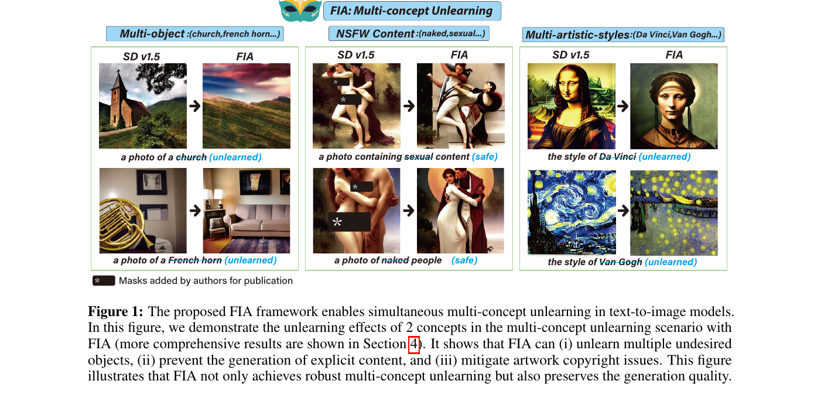
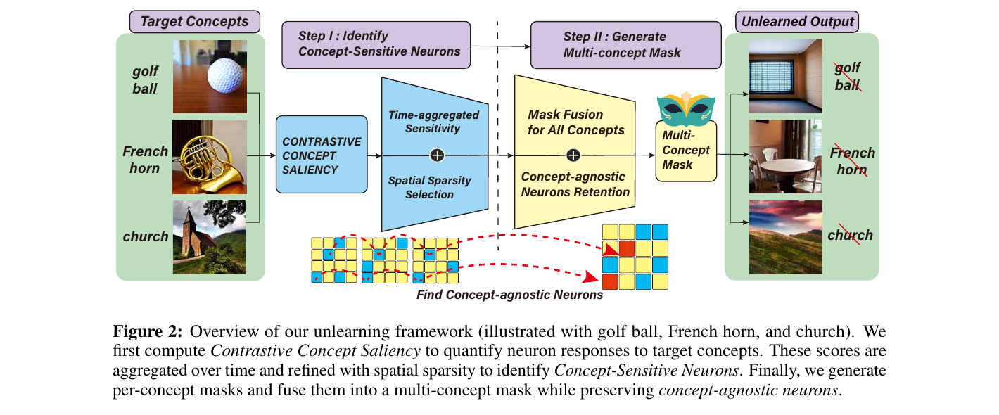

# Forget-It-All: Multi-Concept Machine Unlearning via Concept-Aware Neuron Masking

<p align="center">
  <a href="https://arxiv.org/abs/2601.06163"></a>
  <a href="#"></a>
  <a href="#"></a>
</p>

> **Forget-It-All: Multi-Concept Machine Unlearning via Concept-Aware Neuron Masking**
>
> [Kaiyuan Deng](mailto:kaiyuan0415@arizona.edu)<sup>1</sup>, Bo Hui<sup>3</sup>, Gen Li<sup>2</sup>, Jie Ji<sup>2</sup>, Minghai Qin<sup>5</sup>, Geng Yuan<sup>4</sup>, Xiaolong Ma<sup>1</sup>
>
> <sup>1</sup>The University of Arizona, <sup>2</sup>Clemson University, <sup>3</sup>The University of Tulsa, <sup>4</sup>University of Georgia, <sup>5</sup>Western Digital Corporation

---

## Introduction

Existing single-concept unlearning methods for text-to-image diffusion models break down in real-world settings that require erasing **multiple, interrelated concepts** at once: sequential application either re-acquires forgotten concepts or sacrifices generative quality, and recent multi-concept methods rely on fine-tuning, LoRA stacking, or LLM-derived concept graphs that are hyperparameter-sensitive and computationally heavy. We propose **FIA (Forget-It-All)**, a **training-free** framework that unlearns *arbitrary sets* of concepts by pruning a small subset of neurons. FIA introduces a **Contrastive Concept Saliency** that quantifies each weight's contribution to a target concept, identifies **Concept-Sensitive Neurons** by combining temporal-sparsity and spatial-sparsity selection, and finally constructs per-concept masks that are fused under a **concept-agnostic neuron retention** rule so that broadly useful neurons are preserved while concept-specific ones are pruned. FIA needs only minimal hyperparameter tuning, achieves state-of-the-art unlearning at under **0.3% overall sparsity**, and forgets each concept in roughly **11 seconds** on a single A6000.

<p align="center">
  
</p>
<p align="center"><em>FIA simultaneously unlearns objects, NSFW content, and artistic styles while preserving overall generative quality (paper Figure 1).</em></p>

<p align="center">
  
</p>
<p align="center"><em>Three-stage pipeline. Stage I computes Contrastive Concept Saliency from paired (concept, base) prompts, then aggregates over time and space to identify Concept-Sensitive Neurons. Stage II fuses per-concept masks while retaining Concept-Agnostic Neurons (paper Figure 2).</em></p>

---

## Installation

### Prerequisites

- [Anaconda](https://www.anaconda.com/download)
- NVIDIA GPU with CUDA 12.1 (or above) support — a single A6000 (48 GB) is sufficient; explicit and artist tasks fit on a 24 GB card

### Setup

```bash
# Clone the repository
git clone https://github.com/<your-org>/FIA.git
cd FIA/official

# Create conda environment
conda create -n fia python=3.10 -y
conda activate fia

# Install PyTorch (CUDA 12.1)
pip install torch==2.1.2 torchvision==0.16.2 --index-url https://download.pytorch.org/whl/cu121

# Install remaining dependencies
pip install -r requirements.txt
```

### Verify

```bash
python -c "import torch; print(f'PyTorch {torch.__version__}, CUDA: {torch.cuda.is_available()}')"
```

---

## Usage

### Concept Erasing

**Multi-Object Unlearning (Imagenette)**

```bash
python main.py \
    --config configs/object.yaml \
    --concepts "parachute, golf ball, garbage truck, cassette player, church, tench, \
                english springer, french horn, chain saw, gas pump" \
    --output_dir runs/object_10
```

**Multi-Artistic-Style Unlearning**

```bash
python main.py \
    --config configs/art.yaml \
    --concepts "Van Gogh, Monet, Pablo Picasso, Leonardo Da Vinci, Salvador Dali" \
    --output_dir runs/art_5
```

**Explicit (NSFW) Content Unlearning**

```bash
python main.py \
    --config configs/explicit.yaml \
    --concepts "naked" \
    --output_dir runs/explicit
```

Each pipeline run writes the unlearned UNet to `runs/<task>/edited_unet.safetensors`,
the per-concept saliency tensors to `runs/<task>/saliency/<concept>/`, and a
`fusion_stats.json` summarizing per-layer pruning ratios.

### Evaluation

**Object Erasure Evaluation**

```bash
python evaluation/eval_object.py \
    --ckpt runs/object_10/edited_unet.safetensors \
    --csv  datasets/imagenette.csv \
    --out_dir runs/object_10/eval_imagenette
```

**Nudity / Explicit Content Evaluation**

```bash
python evaluation/eval_explicit.py \
    --ckpt runs/explicit/edited_unet.safetensors \
    --model_id CompVis/stable-diffusion-v1-4 \
    --eval_dataset i2p \
    --out_dir runs/explicit/eval_i2p \
    --max_prompts 300
```

**Artistic Style Evaluation**

```bash
python evaluation/eval_artist.py \
    --ckpt runs/art_5/edited_unet.safetensors \
    --artists "Van Gogh, Monet, Pablo Picasso, Leonardo Da Vinci, Salvador Dali" \
    --out_dir runs/art_5/eval_artist
```

**COCO CLIP Score (Generative Quality)**

```bash
python evaluation/eval_coco.py \
    --prompts_file datasets/coco_prompts.txt \
    --ckpt runs/object_10/edited_unet.safetensors \
    --model_id "runwayml/stable-diffusion-v1-5" \
    --max_prompts 200
```

**Visual Sanity Check (paired base vs. edited)**

```bash
python evaluation/inference.py \
    --ckpt runs/object_10/edited_unet.safetensors \
    --prompt "a photo of a french horn" \
    -n 4
```

### One-Click Reproduction

The three shell scripts under `scripts/` chain training and evaluation for each task:

```bash
bash scripts/run_object.sh
bash scripts/run_explicit.sh
bash scripts/run_art.sh
```

---

## Citation

If you find this work useful, please cite our paper:

```bibtex
@article{deng2026fia,
  title   = {Forget-It-All: Multi-Concept Machine Unlearning via Concept-Aware Neuron Masking},
  author  = {Deng, Kaiyuan and Hui, Bo and Li, Gen and Ji, Jie and Qin, Minghai and Yuan, Geng and Ma, Xiaolong},
  journal = {arXiv preprint arXiv:2601.06163},
  year    = {2026}
}
```

---

## Acknowledgements

We thank the authors of [ESD](https://github.com/rohitgandikota/erasing), [UCE](https://github.com/rohitgandikota/unified-concept-editing), [MACE](https://github.com/Shilin-LU/MACE), [SPM](https://github.com/Con6924/SPM), [FMN](https://github.com/SHI-Labs/Forget-Me-Not), [AC](https://github.com/nupurkmr9/concept-ablation), [SalUn](https://github.com/OPTML-Group/Unlearn-Saliency), and [ConceptPrune](https://github.com/ruchikachavhan/concept-prune) for releasing their code, which we use as baselines and evaluation harnesses. We also rely on [NudeNet](https://github.com/notai-tech/NudeNet), the [I2P benchmark](https://huggingface.co/datasets/AIML-TUDA/i2p), and [Imagenette](https://github.com/fastai/imagenette).
